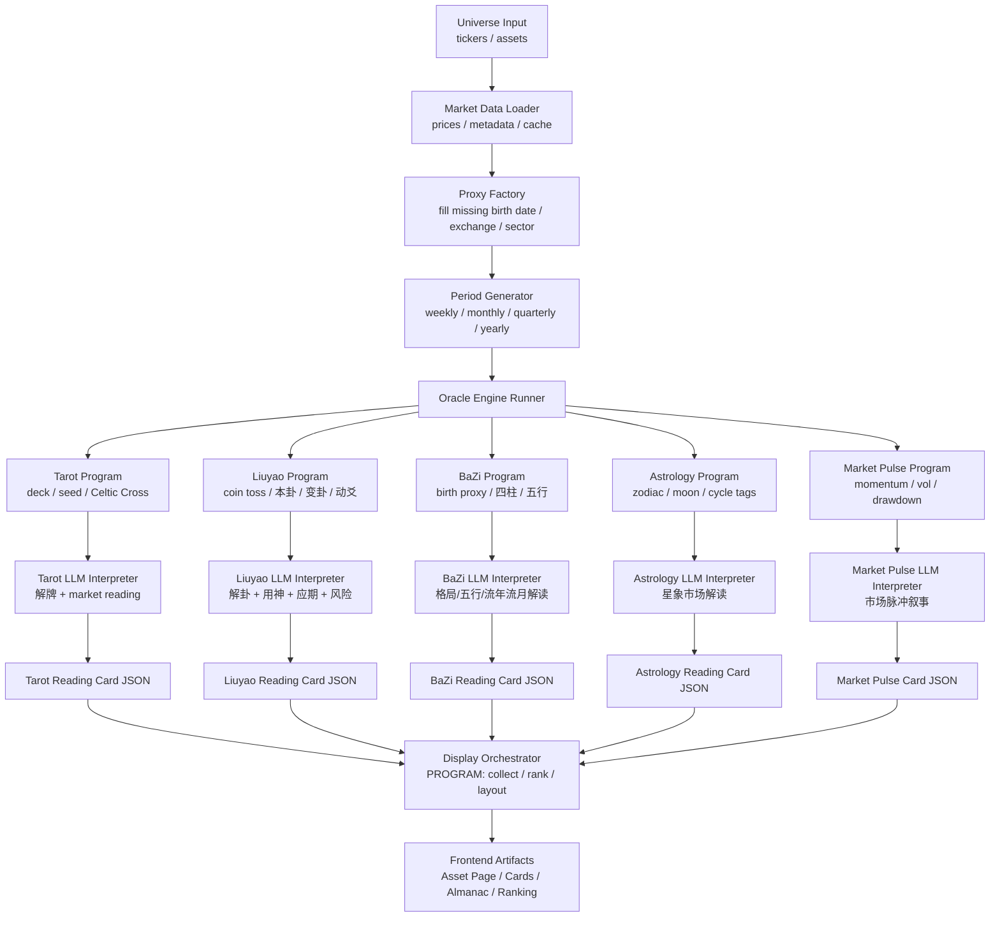

# AUGAR 修正版核心架构

AUGAR 不应该是：

```text
多个模型生成 raw data
        ↓
统一 LLM 总结
        ↓
一个最终答案
```

而应该是：

```text
每个模型独立生成 artifact
        ↓
每个模型独立接 LLM 解读
        ↓
每个模型输出标准 Reading Card
        ↓
前端卡片式并列展示
```

也就是说，Fusion Layer 不再是“综合判断层”，而是 **Display Orchestration Layer**。

它不负责判断谁对谁错，也不负责把所有模型揉成一个结论。
它只负责排序、分组、排版、生成总览字段。

---

## 新流程图



关键变化：

**LLM 在每个 Engine 内部。**
**最后没有统一 LLM 裁判。**
**前端展示的是多张模型卡片。**

---

## 每个 Engine 的内部结构

每个 Engine 分三段。

```text
Program Generator
        ↓
LLM Interpreter
        ↓
Standard Card Output
```

### 1. Program Generator

只负责生成这个模型的“原始占读材料”。

例如：

塔罗：十张牌 + 正逆位 + 牌位
六爻：六次铜钱结果 + 本卦 + 变卦 + 动爻
八字：资产 birth proxy + 四柱 + 五行关系
占星：星座周期 + 月相 + 行星标签
Market Pulse：动量、波动、回撤、趋势标签

### 2. LLM Interpreter

负责真正“解读”。

也就是：

这个卦/牌/盘面对这个资产在这个周期意味着什么；
倾向是好是坏；
风险在哪里；
强度如何；
输出 headline、score、short reading、long reading、risk tags。

### 3. Standard Card Output

每个模型最后必须输出同一种 JSON。

这样前端完全不关心底层模型差异。

---

## 标准输出协议：OracleCard

这是 AUGAR 的核心协议。

```json
{
  "schema_version": "0.1",
  "asset": {
    "ticker": "NVDA",
    "name": "NVIDIA"
  },
  "period": {
    "id": "2026-06-M",
    "label": "June 2026",
    "freq": "M"
  },
  "engine": {
    "id": "liuyao",
    "name": "Wenwang Liuyao",
    "display_name": "文王卦"
  },
  "result": {
    "score": 72,
    "polarity": "favorable",
    "intensity": "high",
    "omen_type": "volatile_blessing",
    "headline": "Thunder Moves Under a Rising Flame",
    "subline": "Favorable movement, but with unstable timing.",
    "short_reading": "The hexagram favors movement, but not calm. Momentum can continue, yet the structure warns against crowded entries and sudden reversal.",
    "long_reading": "..."
  },
  "symbols": [
    "Thunder",
    "Moving Line",
    "Fire",
    "Crowding"
  ],
  "risk_tags": [
    "false_breakout",
    "volatility",
    "late_entry"
  ],
  "raw_artifact": {
    "seed": "liuyao|NVDA|2026-06-M",
    "primary_hexagram": "震为雷",
    "changed_hexagram": "火雷噬嗑",
    "moving_lines": [2, 5]
  },
  "visual": {
    "palette": "ember",
    "icon": "thunder",
    "card_style": "high_intensity"
  }
}
```

这个 JSON 就是前端卡片的输入。

每个 Engine 都输出这个结构。

---

## Score 从哪里来？

这次必须明确：**score 由每个 Engine 的 LLM Interpreter 输出。**

程序可以给 LLM 一些辅助标签，但最终 score 是该模型解释后的结果。

例如六爻：

程序生成卦象：

```json
{
  "asset": "NVDA",
  "period": "June 2026",
  "question": "NVDA 在 June 2026 的市场倾向如何？",
  "hexagram": "震为雷",
  "changed_hexagram": "火雷噬嗑",
  "moving_lines": [2, 5],
  "market_pulse": {
    "momentum": "rising",
    "volatility": "elevated"
  }
}
```

LLM 输出：

```json
{
  "score": 72,
  "polarity": "favorable",
  "intensity": "high",
  "omen_type": "volatile_blessing",
  "headline": "...",
  "short_reading": "...",
  "long_reading": "...",
  "risk_tags": [...]
}
```

也就是说，score 不再是程序硬映射出来的，而是每个模型自己的“评级”。这更符合项目本质。

---

## 后端新分层

后端改成这样：

```text
augar-engine/
  core/
    runner.py
    period.py
    proxy.py
    schema.py
    display_orchestrator.py
    artifact_exporter.py

  generators/
    tarot_generator.py
    liuyao_generator.py
    bazi_generator.py
    astrology_generator.py
    market_pulse_generator.py

  interpreters/
    tarot_interpreter.py
    liuyao_interpreter.py
    bazi_interpreter.py
    astrology_interpreter.py
    market_pulse_interpreter.py

  prompts/
    tarot_prompt.md
    liuyao_prompt.md
    bazi_prompt.md
    astrology_prompt.md
    market_pulse_prompt.md

  engines/
    tarot_engine.py
    liuyao_engine.py
    bazi_engine.py
    astrology_engine.py
    market_pulse_engine.py

  exports/
    json_exporter.py
```

每个 engine 内部调用：

```python
raw = generator.generate(asset, period, context)
card = interpreter.interpret(raw, asset, period, market_context)
return card
```

---

## LLM 接入点重画

现在 LLM 接入点不是一个，而是多个：

```text
Tarot Generator      → Tarot LLM Interpreter
Liuyao Generator     → Liuyao LLM Interpreter
BaZi Generator       → BaZi LLM Interpreter
Astrology Generator  → Astrology LLM Interpreter
Market Pulse Calc    → Market Pulse LLM Interpreter
```

最后的 Display Orchestrator **不接 LLM**，或者最多只做很轻的标题聚合，不作为核心流程。

我建议 v0.1 里最后层不接 LLM，避免它又变成“总裁判”。

---

## 前端展示逻辑

资产页面不是一个统一结论，而是卡片墙。

页面结构：

```text
AUGAR
Ask the Universe, Get a Reading.

NVDA · June 2026

[ Overall Strip ]
AUGAR Composite: Favorable / High Intensity
Dominant Omens: Fire · Thunder · Chariot · Crowding

[ Tarot Card ]
The Chariot Meets the Tower
Score 68 · Favorable · Medium Intensity

[ Liuyao Card ]
Thunder Moves Under a Rising Flame
Score 72 · Favorable · High Intensity

[ BaZi Card ]
Fire Receives Wood, Metal Cuts Late
Score 76 · Favorable · High Intensity

[ Astrology Card ]
Visibility Rises, Noise Expands
Score 61 · Neutral-Favorable · Medium

[ Market Pulse Card ]
Momentum Heated, Volatility Elevated
Score 70 · Heated · High
```

用户点击任何卡片，展开该模型的完整分析。

这比统一解释好很多，因为它保留了“多个神谕分析师”的感觉。

---

## Display Orchestrator 负责什么？

它只做程序化整理。

输入：多个 OracleCard。

输出：

```json
{
  "asset": "NVDA",
  "period": "2026-06-M",
  "composite": {
    "score": 71,
    "polarity": "favorable",
    "intensity": "high",
    "dominant_symbols": ["Fire", "Thunder", "The Chariot", "Crowding"],
    "headline": "The Oracles Lean Upward, But Not Quietly"
  },
  "cards": [
    "tarot_card",
    "liuyao_card",
    "bazi_card",
    "astrology_card",
    "market_pulse_card"
  ]
}
```

Composite 只是前端 summary，不是最终真理。

计算方式也可以很粗暴：

```text
composite_score = average(engine_scores)
dominant_polarity = mode(engine_polarities)
dominant_symbols = most frequent / highest intensity symbols
headline = template-based
```

不用 LLM。

---

## 各模型具体实现方式

### Tarot Engine

**Program：**

生成 Celtic Cross 十张牌，保留 seed、牌位、正逆位。

**LLM：**

解牌，并输出 score / polarity / intensity / headline / reading。

塔罗天然适合：

情绪；
叙事；
隐性阻力；
近未来路径。

---

### Liuyao Engine

**Program：**

六次三枚铜钱；
生成本卦、变卦、动爻；
尽量做基础纳甲/世应/用神标签；
没有就先简化。

**LLM：**

负责真正解卦。

六爻 LLM prompt 必须知道问题类型是：

```text
资产在某周期内的市场倾向
```

所以默认用神可以设为：

价格/收益：妻财
压力/风险：官鬼
流动性/缓和：子孙
公告/信息：父母
竞争/资金分流：兄弟

但 LLM 可以综合解。

---

### BaZi Engine

**Program：**

用 asset birth proxy 生成四柱；
用 period 生成流年/流月；
输出五行关系。

**LLM：**

解读五行生克对资产周期的影响。

BaZi 适合：

年度；
季度；
月度；
行业/资产长期 temperament。

---

### Astrology Engine

**Program：**

生成资产星座、当前 zodiac season、moon phase、可选 retrograde tags。

**LLM：**

解读成 market mood。

适合国际传播。

---

### Market Pulse Engine

**Program：**

算市场指标。

**LLM：**

把指标写成一种“现实派 oracle card”。

它不是科学校验，而是“市场脉冲分析师”。

---

## 接口设计

### 后端生成命令

```bash
python scripts/generate_cards.py \
  --universe configs/universe.yaml \
  --period 2026-06-M \
  --engines tarot,liuyao,bazi,astrology,market_pulse
```

输出：

```text
public/data/cards/2026-06-M/NVDA/tarot.json
public/data/cards/2026-06-M/NVDA/liuyao.json
public/data/cards/2026-06-M/NVDA/bazi.json
public/data/cards/2026-06-M/NVDA/astrology.json
public/data/cards/2026-06-M/NVDA/market_pulse.json

public/data/readings/2026-06-M/NVDA.json
```

其中 `readings/NVDA.json` 是 display orchestrator 拼出来的页面总数据。

---

### 前端读取

```ts
GET /data/readings/{period}/{ticker}.json
```

返回：

```json
{
  "asset": {...},
  "period": {...},
  "composite": {...},
  "cards": [
    {...tarot...},
    {...liuyao...},
    {...bazi...}
  ]
}
```

卡片详情已经内嵌，不需要再请求。

---

## 部署方式

v0.1 最稳：

```text
Python 本地/服务器批量生成
        ↓
JSON artifacts
        ↓
Next.js static frontend
        ↓
Vercel / Cloudflare Pages
```

不做实时后端。
不做用户登录。
不做数据库。
不做在线生成。

想更新内容：

```bash
generate_cards.py
export_public.py
deploy
```

或者后面用 GitHub Actions / VPS cron 自动跑。

---

## 这版架构的正确产品形态

AUGAR 的页面不应该说：

“这是最终综合预测。”

而应该说：

**Five oracles have spoken. Choose the one you trust least.**

这个语气就对了。

用户打开一个资产，不是看一个答案，而是看多个玄学分析师的 divergent readings。这样话题性更强：

塔罗看多；
六爻警告；
八字说火旺；
占星说水逆；
Market Pulse 说过热。

这本身就好玩。

---

## 最终修正版一句话

**AUGAR v0.1 是一个多 Oracle 卡片生成系统：程序为每个算命模型生成原始仪式材料，每个模型分别接 LLM 解读并输出标准化 Reading Card，前端把这些卡片并列展示，形成一个可截图、可展开、可传播的 AI 市场神谕终端。**